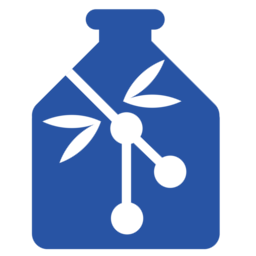

<<<<<<< HEAD
# gin-proc Microservice for [GIN](https://gin.g-node.org)
=======
# [GIN](https://gin.g-node.org) gin-proc Microservice
>>>>>>> 46fa67413a76faef0722c635a6736ff918733d58

<br>

[](https://gin.g-node.org)

This repository contains documentation for using the **gin-proc** microservice for **[GIN](https://gin.g-node.org)** s as well as its setup and support scripts.

<<<<<<< HEAD
=======
Please file an issue if you are experiencing a problem or would like to discuss something related to the microservice.

Pull requests are encouraged if you have changes you believe would improve the setup process or increase compatibility across deployment environments.

>>>>>>> 46fa67413a76faef0722c635a6736ff918733d58
<br>

## Table of Contents
* **[Introduction](#introduction)**
  - [Problem statement](#problem)
  - [Rationale and Significance](#rationale)
<<<<<<< HEAD
* **[Installation](docs/install.md)**
  - [GIN's hosted cloud](docs/install.md#cloud)
  - [Local environment](docs/install.md#local)
    - [Docker Compose](docs/install.md#docker-compose)
    - [Manual](docs/install.md#manual)
* **[Usage](docs/usage.md)**
  - [Workflows](docs/usage.md#workflows)
  - [User's Files](docs/usage.md#files)
* **[Operations](docs/operations.md)**
  - [After Login](docs/operations.md#after-login)
  - [API](http://<GIN-PROC-SERVER>:8000/docs/api/)
  - [Inside Pipeline](docs/operations.md#pipeline)
* **[FAQ](docs/faq.md)**
* **[Authors & Contribution](#authors)**
* **[License](#license)**
\
=======
* **[Installation](#install)**
  - [GIN's hosted cloud](#cloud)
  - [Local environment](#local)
* **[Usage](#usage)**
* **[Tests](#tests)**
* **[FAQ](#questions)**
* **[License](#project-license)**

>>>>>>> 46fa67413a76faef0722c635a6736ff918733d58
<br>

<a name="introduction"></a>
## Introduction

**gin--proc** is a GIN micro-service which allows the users to design efficient workflows for their work - by automating Snakemake, and build the workflows with open-source version of Continuous Integration (CI) service [Drone](https://drone.io/).

<br>

<a name="problem"></a>
### Problem Statement

INCF is hosting a GIN service designed above GOGS with Git to serve as a repository management utility categorically for the Neuroinformatics data. The users (from non-tech backgrounds) find it tough to automate their workflows - precisely going from the input phase to the output phase. A lot of data makes writing workflows a repetitive and redundant task for them. Even if they are using tools like Snakemake. If they are past this stage, still testing all their workflows for potential errors and/or bugs for exorbitant amount of data and their workflows, consumes even more amount of time and reduces their efficiency.

<br>

<a name="rationale"></a>
### Rationale and Significance

This tool/micro-service is required since, given the GIN user base of neuroscientists and other pro-fessionals from the related fields, shouldn’t be involved in writing thousands of repeated workflows for their data, and then testing it manually. This tool will increase their efficiency by almost exponential levels by eradicating redundancy from their work.

<<<<<<< HEAD

<br>

<a name="authors"></a>
## Authors and Contributions
=======
<br>


<a name="run-proc"></a>
## Run gin-proc microservice

Make sure your keys are installed with the GIN container. Micro-service, for now, skips ensuring/installing new keys on the GIN server (Its still in testing).

From project's root...
```export GIN_SERVER=<GIN_IP>:<GIN_PORT>```

```cd back-end && python server.py```

On a new console, go back to project's root and..
```cd front-end && npm run dev```

Log in at your front-end app's SERVER IP displayed in console on endpoint `/login`. 
Only log in with your GIN credentials.

<br>

<a name="usage"></a>
## Usage

In every repository that you create on gin, you have to mandatorily add a **.drone.yml** file which contains the pipelines and build jobs for drone to run.

Use the sample `.drone.yml` file [attached](./samples/.drone.yml) in this repository. Or copy the contents from below.

```
kind: pipeline
name: default

clone:
  disable: true

steps:
- name: clone
  image: docker:git
  environment:
    REPO: test
    GIN_USER: "<YOUR-GIN-USERNAME>" 
    GIN_SERVER: "172.19.0.2"
    SSH_KEY:
      from_secret: DRONE_PRIVATE_SSH_KEY  
  commands:
    - echo "[+] Starting SSH Agent"
    - eval $(ssh-agent -s)

    - echo "[+] Installing SSH Keys"
    - mkdir /root/.ssh && echo "$SSH_KEY" > /root/.ssh/id_rsa && chmod 0600 /root/.ssh/id_rsa
    - echo "StrictHostKeyChecking no" >> /etc/ssh/ssh_config
    - ssh-keyscan -H "$GIN_SERVER" >> /root/.ssh/known_hosts
    - ssh-add /root/.ssh/id_rsa

    # Uncomment the next line if you want to debug SSH Connection failures.
    # - ssh -Tv git@"$GIN_SERVER" -p 22 -i /root/.ssh/id_rsa

    - git clone git@"$GIN_SERVER":/"$GIN_USER"/"$REPO".git
    - echo "[+] Clone complete"

# You can replace the following pipeline step and write your own beyond this point.

- name: proc
  image: ubuntu
  environment:
    REPO: test
  commands:
    - apt-get update
    - apt-get install python -y
    - which python
```

<br>

<a name="tests"></a>
## Tests

The attached sample **.drone.yml** file can be simply used to test whether things are working fine.

We are writing more scripts to perform testing. If anyone wishes to contribute test scripts, a pull request is more than welcome.

<br>

<a name="questions"></a>
## FAQ

Q: Drone throws `permission denied (publickey)` error. How do I resolve this?

A: Add the line `- ssh -Tv git@172.19.0.2 -p 22 -i /root/.ssh/id_rsa` in your clone job in .drone.yml file before running `git clone`. It will present you with complete debug logs of the SSH connection drone tries to make from its container to your GIN container. Errors presented there can help you resolve the issue faster.

---

Q: I get a `Host Key authenticated failed` error during `git clone` in drone pipeline.

A: Either your SSH keys that you have added to GIN and to Drone as a secret don't match, or you can also check if the key pairs you installed needed your sudo password to unlock the keys. If that's the case, create new key pairs without passphrases. And install them.

<br>

<a name="authors-contributors"></a>
## Authors and Contributors
>>>>>>> 46fa67413a76faef0722c635a6736ff918733d58

<table><tbody>
<tr><th align="left">Achilleas Koutsou</th><td><a href="https://github.com/achilleas-k">GitHub/achilleas-k</a></td><td></td></tr>
<tr><th align="left">Michael Sonntag</th><td><a href="https://github.com/mpsonntag">GitHub/mpsonntag</a></td><td></td></tr>
<tr><th align="left">Mrinal Wahal</th><td><a href="https://gitlab.com/wahal">GitLab/wahal</a></td><td><a href="https://mrinalwahal.com/rvagg">MrinalWahal.com</a></td></tr>
</tbody></table>

<<<<<<< HEAD
Contributions are welcome from anyone wanting to improve this project!

Please file an issue if you are experiencing a problem or would like to discuss something related to the microservice.

Pull requests are encouraged if you have changes you believe would improve the setup process or increase compatibility across deployment environments.

<br>

<a name="license"></a>
=======
Contributions are welcomed from anyone wanting to improve this project!

<br>

<a name="project-license"></a>
>>>>>>> 46fa67413a76faef0722c635a6736ff918733d58
## License

This microservice is licensed under the BSD 3-Clause license. All rights not explicitly granted in the MIT license are reserved. See the included [LICENSE.md](./LICENSE.md) file for more details.

------------------------------------------------------------------

*Supported with :heart: by [Achilleas Koutsou](https://github.com/achilleas-k), [Michael Sonntag](https://github.com/mpsonntag) and the [G-Node](https://github.com/orgs/G-Node/people) team.*

*This project is affiliated with [G-Node](http://www.g-node.org/) and [GIN](https://gin.g-node.org).*

<br>

*Neither G-Node nor GIN owns the trademark for Drone.*
